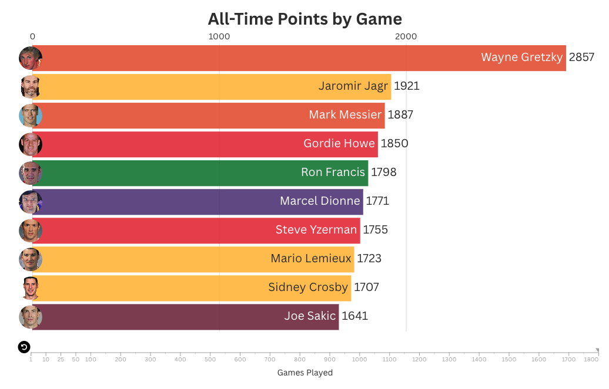

# All-Time-NHL-points-by-number-of-games-played

A dynamic and interactive animated visualization showing all-time NHL points leaders by games played. As the timeline advances, this shows an apple to apple comparison of players from different generations at the same career milestones, revealing who ranks in the top 10. Data was analyzed in SQL, and the visualization was built in Flourish.
https://public.flourish.studio/visualisation/26341913/
